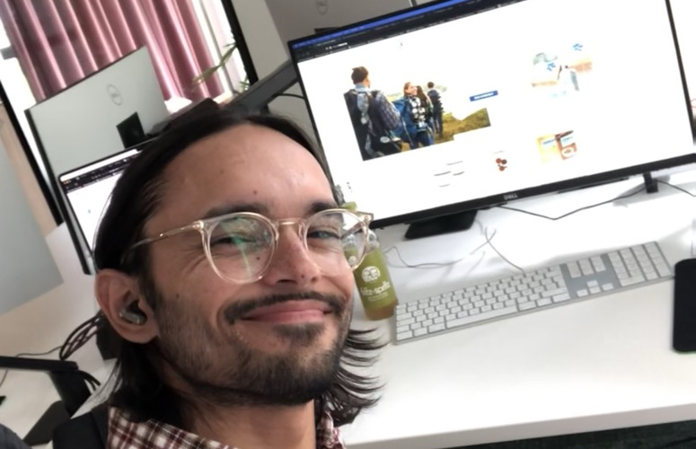

## About Me

I'm Leonard Dost, originally from Baden-Baden, Germany, now based in Lucerne, Switzerland. I'm completing my **Master of Science in Applied Information and Data Science** at HSLU (Lucerne University of Applied Sciences and Arts), graduating in February 2027.

My path into data science wasn't linear. I started studying **Econometrics** at the University of Konstanz, then earned a **BSc in Media Management** from Hochschule RheinMain in Wiesbaden. Along the way I worked in sales consulting, web development, and revenue operations — roles that taught me how businesses actually use data to make decisions. That experience is what pulled me deeper into the technical side: I wanted to be the one building the solutions, not just using them.

## What Drives Me

I'm passionate about developing solutions out of data — whether that means building an end-to-end ML pipeline, designing a cloud-based data platform, or prototyping a mobile app. I thrive in young, ambitious teams and enjoy working internationally. I'm particularly drawn to **machine learning, deep learning, and research-oriented work** where I can push the boundaries of what's possible with data.

## Professional Experience

- **Revenue Operations Specialist** at Seibert Group GmbH (2024-present) — Streamlining business operations, optimizing CRM systems (HubSpot), automating processes
- **Chairman of the Board** at Bildungspatenschaften e.V. (2021-present) — Website development, IT administration, partner research in India, NGO collaboration
- **Web Designer/Developer** at metaX Institut fur Diathetik GmbH (2022-2024) — Website redesign, CRM migration, support and maintenance
- **Sales Consultant** at Seibert Group GmbH (2020-2022) — Client management, process creation, chatbot enhancement, moderated TechTalk on chatbots

## Skills & Technologies

**Data Science & ML:** Python, pandas, scikit-learn, LightGBM, PyTorch, TensorFlow/Keras, statistical modeling, recommendation systems

**Data Engineering:** AWS (Lambda, S3, ECS Fargate, Step Functions, RDS), PostgreSQL, PostGIS, MongoDB, ETL/ELT pipelines, Docker

**Web & Mobile:** React Native, TypeScript, Astro.js, Node.js, Supabase, Turborepo

**Analytics & Visualization:** R, Shiny, Tableau, matplotlib, seaborn, ggplot2

**Languages:** German (native), English (C1), Italian (A1), Hindi (A1)

## Get in Touch

I'm open to opportunities in data science, ML engineering, data consulting, and AI product development. Feel free to connect on [LinkedIn](https://www.linkedin.com/in/leonard-dost-8aa267190/) or explore my work on [GitHub](https://github.com/ledostxx).
